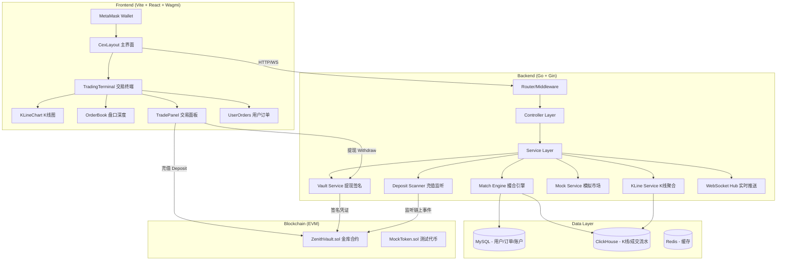

# Zenith Exchange — 混合 CEX 项目全景梳理

> **角色视角**: 高级全栈 Web3 工程师  
> **生成时间**: 2026-04-30  
> **项目定位**: 基于 Go + React + Solidity 的混合型中心化交易所 (Hybrid CEX)

---

## 一、项目总览

Zenith Exchange 是一个 **混合型中心化加密货币交易所**，核心思路是：

- **交易撮合 (Matching Engine)** 在链下 (Off-chain) 完成，提供高性能的限价单撮合
- **资产托管 (Custody)** 通过链上智能合约 (ZenithVault) 管理充值/提现
- **链上签名验证** 保障提现安全，后端私钥签发提现凭证，合约验签后放行



---

## 二、技术栈详解

| 层级 | 技术 | 用途 |
|------|------|------|
| **前端** | Vite + React 19 + TypeScript | SPA 构建 |
| **UI 框架** | Ant Design v6 (暗黑主题) | 组件库 |
| **钱包集成** | Wagmi v3 + ethers.js v6 | MetaMask 连接 & 合约交互 |
| **K线图表** | lightweight-charts v5 | TradingView 风格 K线 |
| **后端框架** | Go + Gin | RESTful API + WebSocket |
| **ORM** | GORM (MySQL) | 关系数据持久化 |
| **时序数据** | ClickHouse | K线聚合 & 成交流水 |
| **缓存** | Redis | 连接池/缓存 |
| **认证** | JWT (HS256) | 无状态身份验证 |
| **精度处理** | shopspring/decimal | 金融级精度运算 |
| **智能合约** | Solidity 0.8.20 + OpenZeppelin v5 | 资产金库 |
| **合约工具链** | Foundry (Forge/Anvil) | 编译/测试/本地链 |
| **链交互** | go-ethereum | Go 端链上监听/签名 |

---

## 三、后端架构分层

### 3.1 目录结构

```
backend/
├── cmd/api/main.go              # 启动入口
├── internal/
│   ├── config/config.yaml       # 配置文件
│   ├── controller/              # 控制器层 (7个 Handler)
│   │   ├── auth.go              #   钱包登录
│   │   ├── assets.go            #   资产余额查询
│   │   ├── vault.go             #   提现签名
│   │   ├── order.go             #   下单/撤单/订单查询
│   │   ├── market.go            #   K线/盘口深度
│   │   ├── ws.go                #   WebSocket 升级
│   │   └── system.go            #   系统配置
│   ├── service/                 # 业务逻辑层 (12个 Service)
│   │   ├── match_engine.go      #   核心撮合引擎
│   │   ├── order.go             #   订单生命周期管理
│   │   ├── auth.go              #   登录/注册
│   │   ├── vault.go             #   提现签名 & Wei 转换
│   │   ├── assets.go            #   资产查询
│   │   ├── market.go            #   市场数据服务
│   │   ├── kline.go             #   K线聚合
│   │   ├── mock.go              #   模拟交易机器人
│   │   ├── deposit_scanner.go   #   链上充值扫描
│   │   ├── wallet.go            #   资产对账
│   │   ├── ws_hub.go            #   WebSocket 广播中心
│   │   └── system.go            #   系统配置输出
│   ├── model/                   # 数据模型层
│   │   ├── user.go              #   用户表
│   │   ├── account.go           #   账户表 (多币种)
│   │   ├── order.go             #   订单表
│   │   ├── balanceLog.go        #   余额变更流水
│   │   ├── tradeLog.go          #   成交日志
│   │   ├── request/             #   请求 DTO
│   │   └── resp/                #   响应 DTO
│   ├── middleware/auth.go       # JWT 认证中间件
│   ├── monitor/deposit_listener.go  # 合约事件监听器
│   ├── contract/                # 合约 ABI 绑定
│   ├── signer/signer.go         # ECDSA 签名器
│   ├── db/db.go                 # 数据库初始化
│   └── router/router.go         # 路由注册
├── pkg/
│   ├── config/config.go         # 全局配置加载
│   ├── utils/
│   │   ├── jwt.go               #   JWT 工具
│   │   ├── signer.go            #   提现签名工具
│   │   ├── contract.go          #   ABI 解析
│   │   └── eth_client.go        #   ETH 客户端
│   └── response/response.go     # 统一响应格式
└── go.mod
```

### 3.2 API 路由表

| 方法 | 路径 | 认证 | Handler | 说明 |
|------|------|------|---------|------|
| GET | `/api/health` | ❌ | inline | 健康检查 |
| POST | `/api/auth/login` | ❌ | `authH.Login` | 钱包地址登录 |
| GET | `/api/market/kline` | ❌ | `marketH.GetKLines` | K线数据 |
| GET | `/api/market/depth` | ❌ | `marketH.GetDepth` | 盘口深度 |
| GET | `/api/system/config` | ❌ | `sysH.GetConfig` | 系统合约配置 |
| GET | `/api/ws` | ✅ | `wsH.HandleWS` | WebSocket 连接 |
| GET | `/api/assets/balance` | ✅ | `assetsH.GetBalance` | 用户资产余额 |
| POST | `/api/vault/withdraw-sign` | ✅ | `vaultH.HandleWithdraw` | 提现签名 |
| GET | `/api/order/today` | ✅ | `orderH.GetTodayList` | 今日订单 |
| POST | `/api/order/place` | ✅ | `orderH.Place` | 下单 |
| POST | `/api/order/cancel` | ✅ | `orderH.Cancel` | 撤单 |
| GET | `/api/order/list` | ✅ | `orderH.GetAllOrders` | 历史订单 |
| GET | `/api/order/detail/:id` | ✅ | `orderH.GetDetail` | 订单详情 |

### 3.3 数据模型

```
User (MySQL)
├── ID: uint64 (PK)
├── WalletAddress: char(42) (唯一索引)
├── ApiKey: varchar(64) (唯一)
├── CreatedAt: datetime
└── Accounts: []Account (外键关联)

Account (MySQL) — 多币种钱包
├── ID: uint64 (PK)
├── UserID: uint64 (联合索引: user_id + currency)
├── Currency: varchar(20) — "USDT" / "BTC" / "ETH"
├── Available: decimal(36,18) — 可用余额
├── Frozen: decimal(36,18) — 冻结余额
├── Version: uint32 — 乐观锁版本号
└── UpdatedAt: datetime

Order (MySQL)
├── ID: uint64 (PK)
├── UserID: int64
├── Symbol: varchar(20) — "BTC_USDT"
├── Side: enum('buy','sell')
├── Type: enum('limit','market') — 默认 limit
├── Price: decimal(36,18)
├── Amount: decimal(36,18)
├── FilledAmount: decimal(36,18) — 已成交量
├── Status: int8 — 0:挂单, 1:部分, 2:全额, 3:撤单
├── MsgHash: char(66)
├── Signature: text
├── IsMock: bool
└── CreatedAt / UpdatedAt

BalanceLog (MySQL/ClickHouse)
├── UserID, Currency, ChangeType, Amount, Balance, LogTime

TradeLog (ClickHouse)
├── TradeID, OrderID, UserID, Symbol, Price, Amount, Fee, Side, TradeTime
```

---

## 四、核心业务流程

### 4.1 用户登录流程

```
1. 前端连接 MetaMask → 获取钱包地址
2. 前端签名欢迎消息 (EIP-191) → 证明地址所有权
3. POST /api/auth/login { address }
4. 后端: 查找或创建 User → 初始化 USDT/ETH/BTC 三个 Account → 生成 JWT
5. 前端存储 Token 到 localStorage
```

### 4.2 撮合引擎 (Match Engine)

```
内存订单簿 (OrderBook)
├── Bids: []*OrderItem — 按价格降序 + 时间升序
├── Asks: []*OrderItem — 按价格升序 + 时间升序
└── mu: sync.Mutex — 并发安全

下单流程:
1. 冻结资产 (买单冻结计价币, 卖单冻结基础币)
2. 创建订单记录到 MySQL
3. 异步送入撮合引擎 ProcessOrder()
4. Taker 与 Maker 逐笔匹配 (价格优先, 时间优先)
5. 每笔成交: 数据库事务更新双方余额 + 乐观锁
6. 写入 ClickHouse (trades/trade_logs)
7. WebSocket 广播深度变更 + 成交推送

撤单流程:
1. 行锁定目标订单 (FOR UPDATE)
2. 计算未成交量 → 解冻对应资产
3. 更新状态为 3 (已撤单)
4. 从内存订单簿移除 + 广播盘口
```

### 4.3 充值流程 (Deposit)

```
前端:
1. ethers.js → TokenContract.approve(vaultAddr, amount)
2. ethers.js → VaultContract.deposit(tokenAddr, amount)
3. 链上 Vault 合约触发 Deposit 事件

后端 (双重监听):
├── DepositScanner: 监听 ERC20 Transfer 事件 → 匹配 to=Vault → 给用户加钱
└── DepositMonitor: 监听 Vault.Deposit 事件 → ABI 解析 → 更新余额 + WS 推送
```

### 4.4 提现流程 (Withdraw)

```
1. 前端 → POST /api/vault/withdraw-sign { amount, currency }
2. 后端:
   a. 行锁查询账户 (FOR UPDATE)
   b. Wei 精度校验余额
   c. 数据库扣款 (Available -= amount)
   d. 后端私钥签名 (EIP-191: user + token + amount + nonce + vault + chainId)
   e. 返回 { signature, nonce, amount, vault, token }
3. 前端:
   a. ethers.js → VaultContract.withdraw(token, amount, nonce, signature)
   b. 链上合约: 验签 → 校验 nonce → 扣除合约余额 → ERC20 转账
```

### 4.5 模拟市场 (Mock Service)

```
三大后台协程:
├── StartDepthInjection: 每2秒注入 ±10 档虚假盘口 (IsMock=true)
├── startActiveMatchingTask: 每2秒取中间价执行模拟成交 → 驱动 K 线
└── StartUserOrderSweeper: 每3秒扫描盘口前5档真实订单 → 强制撮合结算
```

### 4.6 K线聚合 (KLine Service)

```
数据流: trades 表 → 定时聚合 → klines_1m/5m/15m/1h/1d

ClickHouse 聚合 SQL:
- open: argMin(price, ts)
- high: max(price)
- low: min(price)
- close: argMax(price, ts)
- volume: sum(amount)

前端通过 REST 拉取 + WebSocket 实时推送 KLINE_UPDATE
```

### 4.7 WebSocket 推送

```
Hub 架构:
├── Clients: map[userID]*Client — 全局用户注册表
├── Rooms: map[roomName]map[*Client]bool — 主题订阅房间
├── Broadcast: chan []byte — 全局广播
└── TopicChan: chan TopicMessage — 定向主题推送

房间命名: "depth:BTC_USDT", "trade:BTC_USDT", "kline:BTC_USDT"

客户端订阅格式:
{ "action": "subscribe", "topic": "depth", "symbols": ["BTC_USDT"] }
```

---

## 五、智能合约

### 5.1 ZenithVault.sol

```solidity
核心功能:
├── deposit(token, amount): 用户充值 ERC20 到金库
├── withdraw(token, amount, nonce, signature): 后端签名授权提现
├── setSigner(newSigner): 更换后端签名者 (Owner Only)
└── backendSigner: 存储后端签名地址

安全机制:
├── ECDSA 签名验证 (OpenZeppelin v5)
├── Nonce 防重放攻击
├── EIP-191 消息签名标准
└── Ownable 权限控制
```

### 5.2 MockToken.sol

```solidity
标准 ERC20 + 无限 mint 功能 (测试用)
初始供应量: 1,000,000 ZNT
```

---

## 六、前端架构

### 6.1 组件树

```
App.tsx (Ant Design ConfigProvider 暗黑主题)
└── CexLayout.tsx — 主布局 (Header + 登录/登出)
    ├── WelcomeView.tsx — 未登录欢迎页
    └── TradingTerminal.tsx — 已登录交易终端
        ├── KLineChart.tsx — lightweight-charts K线
        ├── OrderBook.tsx — 实时盘口深度
        ├── TradePanel.tsx — 买入/卖出/提现/充值
        ├── UserOrders.tsx — 今日/历史订单 + 撤单
        └── UserOrderInfo.tsx — 订单详情
```

### 6.2 Hooks

```
useDeposit.ts — 充值流程 (approve → deposit → 余额检查 → 错误分类)
useWithdraw.ts — 提现流程 (获取签名 → 合约调用 → 状态反馈)
```

### 6.3 状态管理

- 无全局 Store (无 Redux/Zustand)
- 通过 `useState` + `useCallback` + 组件 Props 传递
- WebSocket 在 TradingTerminal 中通过 `useRef` 管理

---

## 七、已知问题与技术债务

### 7.1 安全风险 🔴

| # | 问题 | 严重度 | 位置 |
|---|------|--------|------|
| 1 | JWT Secret 硬编码在配置文件中 | 高 | `config.yaml:6` |
| 2 | 数据库密码明文存储 | 高 | `config.yaml:18` |
| 3 | 私钥文件路径写死为相对路径 | 高 | `config.yaml:13` |
| 4 | CORS 设置 `Allow-Origin: *` | 中 | `router.go:73` |
| 5 | WebSocket `CheckOrigin` 返回 true | 中 | `ws.go:11` |
| 6 | Vault 合约 nonce 基于时间戳而非链上 nonce | 高 | `signer.go:82-83` |
| 7 | DepositScanner 使用 `log.Fatalf` 会直接退出进程 | 高 | `deposit_scanner.go:87` |

### 7.2 架构问题 🟡

| # | 问题 | 说明 |
|---|------|------|
| 1 | 双重 Deposit 监听器 | `DepositScanner` 和 `DepositMonitor` 功能重叠，可能重复入账 |
| 2 | Mock Service 与真实订单混合 | Sweeper 强制撮合用户订单, 价格可能偏离用户预期 |
| 3 | 内存订单簿无持久化 | 服务重启时从 MySQL 恢复, 但 Mock 订单会丢失 |
| 4 | VaultService 未正确注入 Config | `controller/vault.go` 用 `&service.VaultService{}` 零值, 签名时 `cfg` 为 nil |
| 5 | Hub 创建了两个实例 | `main.go:39` 和 `main.go:54` 各创建一个 Hub, MarketService 用的不是主 Hub |
| 6 | 无数据库迁移管理 | 使用 GORM AutoMigrate, 无版本化迁移 |
| 7 | BalanceLog 存在于 MySQL 但缺少 AutoMigrate | `db.go:65` 只迁移了 User/Account/Order |
| 8 | 提现 Nonce 不匹配链上逻辑 | 后端用时间戳作 nonce, 合约用 `nonces[msg.sender]` 递增 nonce |

### 7.3 代码质量 🟢

| # | 问题 | 位置 |
|---|------|------|
| 1 | `ioutil.ReadFile` 已废弃 | `pkg/config/config.go:81` |
| 2 | `c.GetInt64` / `c.GetString` 零值不安全 | `vault.go:34-35` |
| 3 | Type assertion `userID.(int64)` 无保护 | `order.go:50,89,100,115` |
| 4 | 前端 `getOrderDetail` 路径错误 | `api/order.ts:16` → `/detail/${id}` 缺少 `/order` 前缀 |
| 5 | `deposit_scanner.go:95` 使用 `s.DB` 但 `s.DB` 未初始化 | 应使用 `dao.DB` |

---

## 八、待办任务清单 (Task List)

### P0 — 紧急修复 (阻塞运行)

- [ ] **修复 VaultService Config 注入**: `controller/vault.go` 中 `VaultService{}` 需传入 `config.GlobalConfig`
- [ ] **修复提现 Nonce 不匹配**: 后端 nonce 应改为从链上读取 `nonces[user]`, 而非时间戳
- [ ] **修复 Hub 双实例问题**: `main.go` 中 MarketService 应复用主 Hub, 删除 `hubSvc := service.NewHub()`
- [ ] **修复 DepositScanner 的 DB 空指针**: `deposit_scanner.go:95` 中 `s.DB` 未赋值, 应使用 `dao.DB`
- [ ] **修复 BalanceLog 表未自动迁移**: 在 `db.go:65` 添加 `&model.BalanceLog{}`
- [ ] **移除重复充值监听**: 合并 `DepositScanner` 和 `DepositMonitor`, 防止双重入账

### P1 — 安全加固

- [ ] 将 JWT Secret / 数据库密码迁移到环境变量或 Vault
- [ ] 收紧 CORS 策略, 限定前端域名
- [ ] WebSocket CheckOrigin 增加域名白名单
- [ ] 私钥管理迁移到 KMS 或加密存储
- [ ] 增加提现限额 / 冷却时间 / 二次验证
- [ ] 增加签名消息的链上验证 (登录时的 EIP-191 签名后端未校验)

### P2 — 功能完善

- [ ] 实现市价单 (Market Order) 撮合逻辑 (目前只有限价单)
- [ ] 支持多交易对 (当前仅 BTC_USDT)
- [ ] 实现手续费 (Fee) 计算与收取
- [ ] 前端增加全局状态管理 (Zustand / Jotai)
- [ ] 实现用户资产变更的 WebSocket 推送 (已有 BALANCE_UPDATE 但未完整集成)
- [ ] 增加充值/提现历史记录查询接口
- [ ] 前端 `getOrderDetail` API 路径修正
- [ ] 实现订单成交明细 (Trade History) 查询

### P3 — 工程化提升

- [ ] 引入数据库迁移工具 (golang-migrate / goose)
- [ ] 添加单元测试 (当前仅 `signer_test.go`)
- [ ] 替换 `ioutil.ReadFile` 为 `os.ReadFile`
- [ ] 统一 Controller 层 Context Value 的安全取值模式
- [ ] 增加 Structured Logging (替换 `log.Printf`)
- [ ] 增加 Prometheus 监控指标
- [ ] Docker Compose 编排 (MySQL + ClickHouse + Redis + Anvil)
- [ ] CI/CD 流水线配置
- [ ] 前端增加 E2E 测试

### P4 — 性能优化

- [ ] 订单簿数据结构优化 (使用红黑树/跳表替代 slice + sort)
- [ ] ClickHouse K线聚合改为增量模式 (当前每次扫描 2 小时)
- [ ] Redis 缓存层实现 (盘口快照、用户余额缓存)
- [ ] WebSocket 消息压缩与批量推送
- [ ] 数据库连接池优化

---

## 九、部署依赖

```bash
# 基础设施
- MySQL 8.x (数据库: cex, 端口: 3306)
- ClickHouse (数据库: cex, 端口: 9000)
- Redis (端口: 6379)
- Anvil / Sepolia (以太坊节点, 端口: 8545)

# 启动顺序
1. 启动 Anvil → forge script 部署合约
2. 启动 MySQL / ClickHouse / Redis
3. 创建 ClickHouse 表 (trades, trade_logs, klines_1m/5m/15m/1h/1d, uniswap_events)
4. 配置 .secrets/signer.key (Anvil 部署者私钥)
5. 启动后端: cd backend && go run cmd/api/main.go
6. 启动前端: cd web && npm run dev
```

---

## 十、文件索引 (快速定位)

| 关注点 | 文件路径 |
|--------|----------|
| 项目入口 | `backend/cmd/api/main.go` |
| 撮合引擎 | `backend/internal/service/match_engine.go` |
| 订单管理 | `backend/internal/service/order.go` |
| 提现签名 | `backend/pkg/utils/signer.go` |
| 充值监听 | `backend/internal/monitor/deposit_listener.go` |
| 模拟市场 | `backend/internal/service/mock.go` |
| K线聚合 | `backend/internal/service/kline.go` |
| WebSocket | `backend/internal/service/ws_hub.go` |
| 金库合约 | `contracts/src/ZenithVault.sol` |
| 前端主布局 | `web/src/components/CexLayout.tsx` |
| 交易面板 | `web/src/components/TradePanel.tsx` |
| 充值 Hook | `web/src/hooks/useDeposit.ts` |
| 提现 Hook | `web/src/hooks/useWithdraw.ts` |
| HTTP 拦截器 | `web/src/utils/request.ts` |
